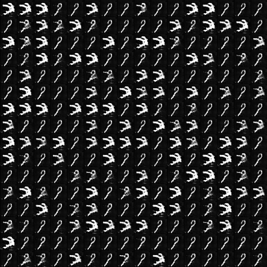
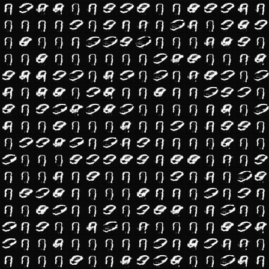
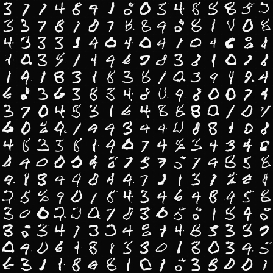
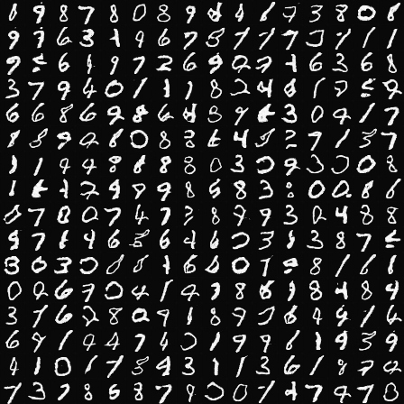

# MNIST_GAN
Reproduct of GAN for MNIST.
Just for learning the basic knowledges about Generative Adversarial Networks (GAN).

## Results
Epoch 2500 17900 30200 40000

   

## Basic Thoughts
GAN has a *generator* generates fake instances from noises, and a *discriminator* 
distinguishes the fake instances and real instances.

Training both two networks reaches a Nash Equilibrium the GAN model is converged.

## Structure
The generator is a U-Net-like backbone with two downsampling stages and 
two upsampling stages. The discriminator is a VGG-like backbone with an average pooling after two
convolutions and a global average pooling before fully connected.

## Usage
Simple:
```shell 
python mnist_gan.py
```

Costume:
```shell
python mnist_gan.py \
--learning_rate 0.01 \
--batch_szie 256 \
--epochs 40000 \
--smooth 0.9 \
--dataset_path /path/to/your/MNIST/dir/mnist.npz \
--model_dir /path/to/your/saved/model/dir \
--log_dir /path/to/your/saved/log/dir
``` 

## Tips
This GAN project is build up following these [advices](https://github.com/soumith/ganhacks).
